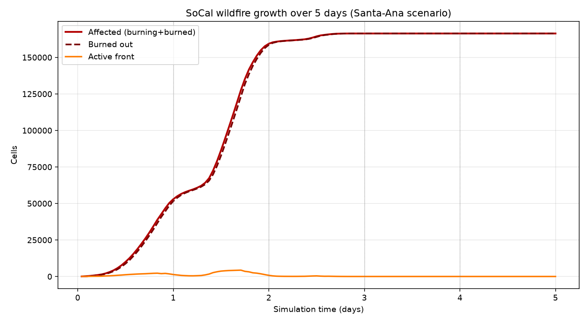
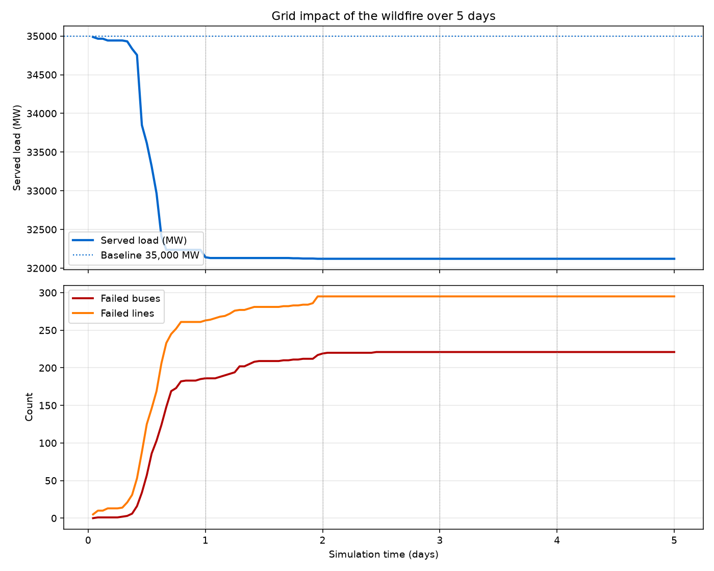
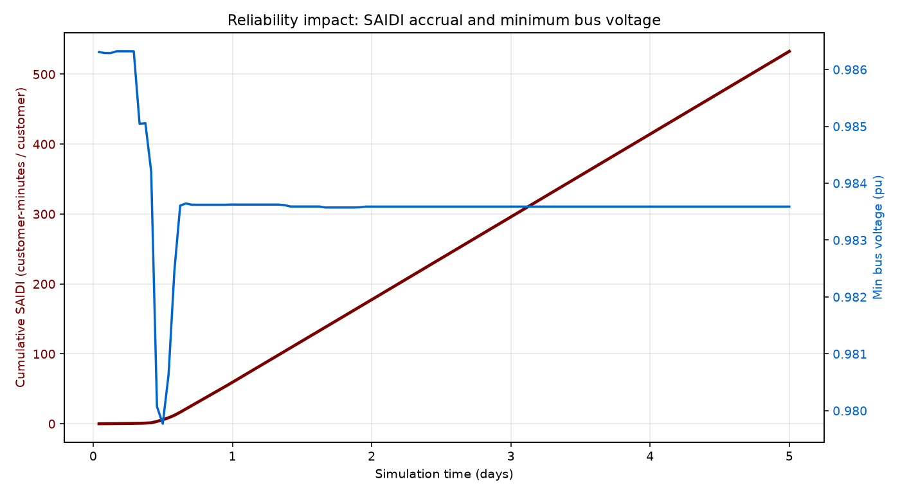
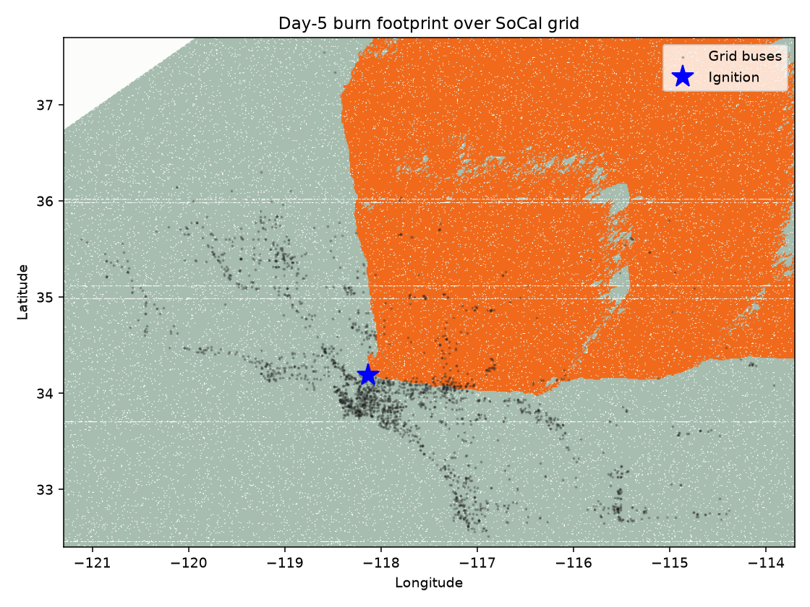

# SoCal Wildfire — 5-Day Grid Impact Analysis

**Scenario:** `phase_0_santa_ana_5day` — a Santa-Ana driven wildfire 
ignited in the Los Angeles basin (Eaton/Palisades-fire-like origin, 
lon/lat = -118.13, 34.19), simulated over **120 hourly 
steps (5 days)** on the full SoCal transmission/sub-transmission model 
(2,294 buses, 2,595 lines).

The wildfire is realised as a **GUARDIAN Constrained-Mutation operator**: 
an Overseer-Adversary parameter vector \(\Theta\) (ignition, wind, fuel 
moisture, global ROS multiplier \(\kappa\)) drives a cellular-automaton 
fire \(\tau\); a damage mapper \(D\) removes burned/heat-exposed buses and 
lines; and a pandapower power flow is solved on the mutated topology each step.

## Headline results

- **Baseline served load:** 35,000 MW (~7,000,000 customers).
- **Final burn footprint:** 166,372 cells affected, of which 166,372 fully burned out.
- **Peak active fire front:** 4,339 cells.
- **Grid assets lost (day 5):** 213 buses and 327 lines de-energised.
- **Peak customers disconnected:** 734,417 (around day 2.5).
- **Minimum served load (converged):** 31,328 MW.
- **Minimum bus voltage at day 5:** 0.984 pu.
- **Cumulative SAIDI at day 5:** 690 customer-minutes per customer.

## Daily progression

| Day | Affected cells | Burned cells | Active front | Failed buses | Failed lines | Served MW | Customers disconnected | SAIDI (min) | Min Vm (pu) |
|----:|---------------:|-------------:|-------------:|-------------:|-------------:|----------:|-----------------------:|------------:|------------:|
| 1 | 52,913 | 51,564 | 1,349 | 198 | 315 | 31,334 | 733,115 | 86 | 0.984 |
| 2 | 159,365 | 158,587 | 778 | 212 | 325 | 31,334 | 733,115 | 236 | 0.984 |
| 3 | 166,372 | 166,372 | 0 | 213 | 327 | 31,328 | 734,417 | 387 | 0.984 |
| 4 | 166,372 | 166,372 | 0 | 213 | 327 | 31,328 | 734,417 | 538 | 0.984 |
| 5 | 166,372 | 166,372 | 0 | 213 | 327 | 31,328 | 734,417 | 690 | 0.984 |

## Meteorological forcing

The deterministic \(\Theta\) schedule mirrors a real Santa-Ana event:

- **Days 1–3 (offshore window):** strong, gusty NE→SW wind (12–24 m/s, diurnally modulated, peaking mid-afternoon), critically dry dead-fuel moisture (3%), high ROS multiplier \(\kappa = 3.0\). This is the explosive growth phase.
- **Day 4 (transition):** wind eases, fuel moisture climbs to 10%, \(\kappa = 1.8\).
- **Day 5 (marine-layer recovery):** light wind, 20% fuel moisture, \(\kappa = 1.2\) — front activity collapses and the fire transitions to smouldering/burn-out.

## Figures

*Fire growth: affected, burned-out, and active-front cell counts over the 5-day run. Note the steep Santa-Ana growth through day 3 and the plateau as the front burns out and weather recovers.*

*Top: served load (MW) against the converged baseline. Bottom: cumulative failed buses and lines as the fire front sweeps through grid corridors.*

*Reliability impact: cumulative SAIDI minutes (left axis) and minimum bus voltage (right axis). SAIDI accrues fastest during the day-1–3 outage peak.*

*Day-5 burn footprint (orange) over the SoCal grid buses (grey), with the ignition point starred in the LA basin. By day 5 the entire perimeter has burned out. The contiguous burn scar engulfs the dense bus cluster around the ignition origin and propagates along the wind-driven front, which is why the failed-asset count saturates within the first ~36 hours.*

## Interpretation

The simulation demonstrates the full GUARDIAN causal chain end-to-end: a single ignition point, under realistic Santa-Ana forcing, grows a fire that physically intersects transmission corridors, the damage mapper removes the affected assets, and the resulting power-flow solution shows a measurable loss of served load and depressed bus voltages. The disconnected-customer count — the adversary's reward signal — rises sharply during the offshore-wind window and then stabilises as the front burns out, exactly the dynamics seen in the January 2025 LA-basin fires.

*Generated by `analysis/run_5day.py`. KPIs are in `five_day_kpis.csv`.*
